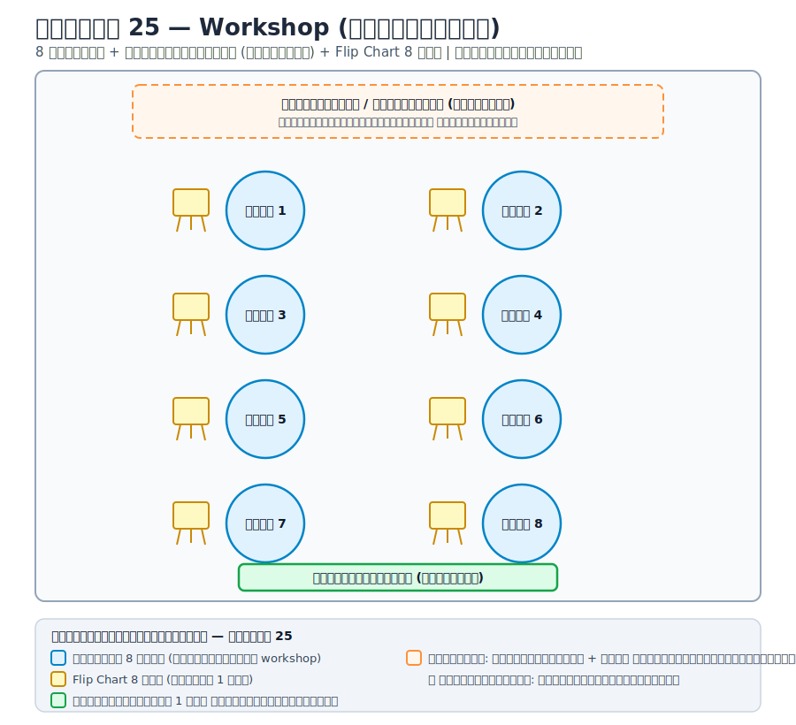
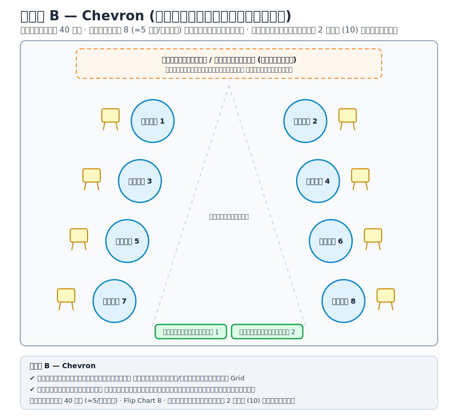
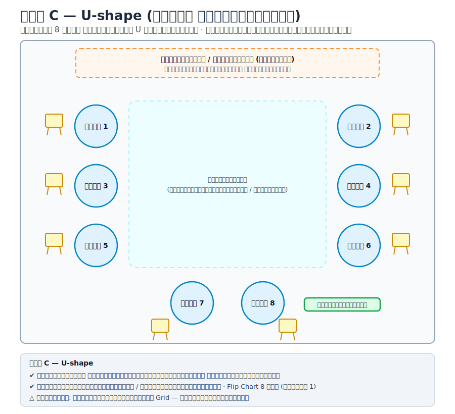
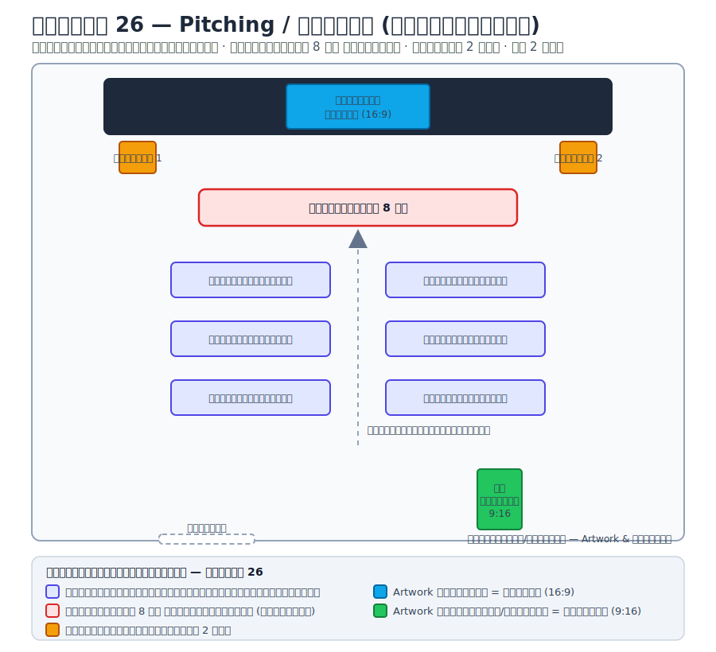
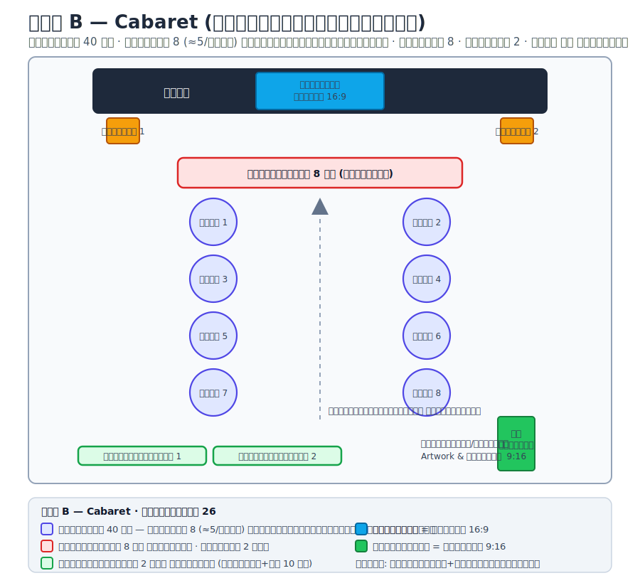
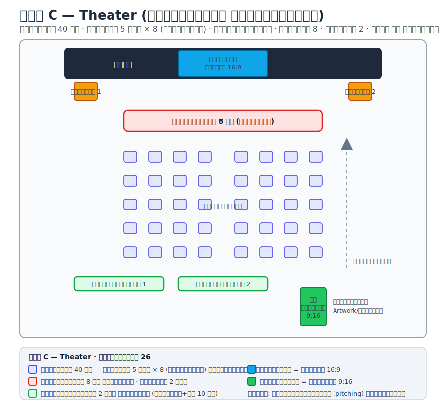

# แจ้งการจัดสถานที่กับโรงแรม — งาน NewGen รุ่น 2 (วันที่ 25–26)

ผังการจัดโต๊ะ อุปกรณ์ และ artwork แต่ละวัน สำหรับส่งให้โรงแรมและทีมงานดูร่วมกัน

**จำนวนคน:** ผู้เรียน **40 คน** · วิทยากร + อาจารย์ **10 คน**

---

## 🗓️ วันที่ 25 — Workshop (จัดโต๊ะกลม)

| รายการ | รายละเอียด |
|---|---|
| รูปแบบโต๊ะ | **โต๊ะกลม 8 โต๊ะ** จัดเป็นกลุ่ม (ผู้เรียน 40 คน ≈5 คน/โต๊ะ) |
| โต๊ะทีมอาจารย์ | **2 ตัว จัดไว้ด้านหลังห้อง** (วิทยากร+อจ 10 คน) |
| อุปกรณ์ | **Flip Chart 8 อัน** (โต๊ะละ 1 อัน) |
| เวที | อยู่ด้านหน้าห้อง |
| ช่วงเย็น | เมื่อกิจกรรมของเราเสร็จ **ทีมแสงสีเสียงและเวทีเข้าติดตั้งได้เลย** |
| ห้องจัดเลี้ยง | **แยกไปใช้อีกห้องหนึ่ง** (ไม่ใช่ห้องเดียวกับ workshop) |

### 🔀 ทางเลือกการจัดโต๊ะกลม 8 โต๊ะ (เลือกได้ตามห้อง/กิจกรรม)

**แบบ A — Grid 2×4 (แถวตรง)** — มาตรฐาน จุคนได้มากที่สุดต่อพื้นที่ เดินระหว่างแถวสะดวก

**แบบ B — Chevron (เฉียงหันเข้าเวที)** — ทุกโต๊ะเห็นเวที/จอชัด ทางเดินกลางกว้าง เหมาะช่วงบรรยายสลับ workshop

**แบบ C — U-shape (ตัวยู เปิดกลางห้อง)** — วิทยากรเดินให้คำปรึกษาทุกโต๊ะง่าย เห็นหน้ากันทั่วถึง เหมาะกิจกรรมโต้ตอบสูง (ใช้พื้นที่มากกว่า)

| เกณฑ์ | แบบ A · Grid | แบบ B · Chevron | แบบ C · U-shape |
|---|:---:|:---:|:---:|
| เห็นเวที/จอ | ปานกลาง | **ดีมาก** | ดี |
| เดินให้คำปรึกษา | ดี | ดี | **ดีมาก** |
| จุคนต่อพื้นที่ | **มากสุด** | ปานกลาง | น้อยสุด |
| เหมาะกับ | บรรยาย+กลุ่ม | บรรยาย/นำเสนอ | ระดมสมอง/โต้ตอบ |

> ทุกแบบใช้ **โต๊ะกลม 8 โต๊ะ + Flip Chart 8 อัน (โต๊ะละ 1) + โต๊ะทีมอาจารย์ 2 ตัวด้านหลัง** เหมือนกัน เปลี่ยนเฉพาะการวางผัง

---

## 🗓️ วันที่ 26 — Pitching / นำเสนอ (จัดโต๊ะหันเข้าเวที)

องค์ประกอบที่เหมือนกันทุกแบบ: **โต๊ะกรรมการ 8 คน หน้าเวที · โพเดียม 2 อัน · โต๊ะทีมอาจารย์ 2 ตัวด้านหลัง (วิทยากร+อจ 10 คน)**

### 🔀 ทางเลือกการจัดผังวันที่ 26 (3 แบบ)

**แบบ A — Classroom (โต๊ะยาวหันเข้าเวที)** — ผู้เรียนมีโต๊ะเขียน/จดโน้ตเต็มที่ เหมาะฟังบรรยาย+จดบันทึก

**แบบ B — Cabaret (โต๊ะกลมหันเข้าเวที)** — เว้นที่นั่งด้านหน้าให้หันเข้าเวที ทำงานกลุ่มสลับดูนำเสนอได้

**แบบ C — Theater (เก้าอี้แถว ไม่มีโต๊ะ)** — จุคนได้มากสุด เน้นดูการนำเสนอ (pitching) เต็มรูปแบบ

| เกณฑ์ | แบบ A · Classroom | แบบ B · Cabaret | แบบ C · Theater |
|---|:---:|:---:|:---:|
| มีโต๊ะเขียน/จดโน้ต | **มี (เต็มที่)** | มี | ไม่มี |
| ทำงานกลุ่ม | ปานกลาง | **ดี** | น้อย |
| จุคน/พื้นที่ | ปานกลาง | น้อย | **มากสุด** |
| เหมาะกับ | ฟัง+จด | กลุ่ม+นำเสนอ | ดู pitching |

### Artwork / จอภาพ
| ตำแหน่งจอ | ทิศทาง | สัดส่วน | ใช้สำหรับ |
|---|---|---|---|
| **จอในห้อง** (บนเวที) | แนวนอน | 16:9 | นำเสนอ / presentation |
| **จอหน้าห้อง / ทางเข้า** | แนวตั้ง | 9:16 | Artwork, ป้ายงาน / signage |

> ⚠️ ทีมออกแบบเตรียม artwork **2 ขนาด**: แนวนอน (จอในห้อง) และแนวตั้ง (จอหน้าห้อง)

---

## ✅ Checklist ก่อนส่งโรงแรม
- [ ] เลือกผังวันที่ 25 (A/B/C) และวันที่ 26 (A/B/C) ที่จะใช้จริง
- [ ] ยืนยันจำนวนที่นั่ง: ผู้เรียน 40 (≈5/โต๊ะ) + วิทยากร/อจ 10 (โต๊ะหลัง 2 ตัว)
- [ ] ยืนยันเวลาเข้าติดตั้งแสงสีเสียง–เวที ช่วงเย็นวันที่ 25
- [ ] ยืนยันชื่อ/ตำแหน่งห้องจัดเลี้ยง (คนละห้องกับ workshop)
- [ ] ส่งไฟล์ artwork 2 สัดส่วน (16:9 และ 9:16) ให้โรงแรม
- [ ] ยืนยันตำแหน่งโพเดียม 2 อัน และไมค์
